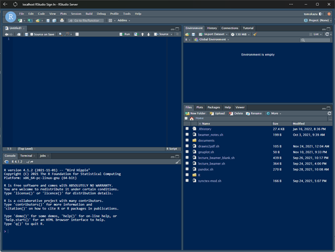

# RとRStudioのインストール

## Rが使えるパソコン

Rはオープン・ソースで開発されており，Windows，Mac，Linuxのいずれでも利用可能。Rそのものは性能の低いマシンでも十分に動作する(ただし，分析するデータの規模や用いる分析手法によってはある程度高性能なパソコンが必要になるかもしれない)。また，RStudioはRを便利に使うために必須と言えるソフトウェア。

これからパソコンを用意するという人には，Mac > Linux > Windowsの順でおすすめする。(わたしが)Rを使っていてトラブルが少ないのはMac。LinuxもMacと共通の部分が多く安定しているが，そもそも一般の人にLinuxは馴染みがないので，R以外の用途を考えると選択肢からは外れそう。Windowsは最初に少し設定が必要なのと，フォルダやファイル名に注意して利用する必要がある。といっても，いま使っているPCがWindowsであれば，買い換えるほどのものでもない。

Windowsの場合には，WSLという仮想環境のLinuxにRをインストールして使うことも可能。わたしは，WSLにRとRStudio Serverをインストールして，ChromeなどのブラウザでRStudioを使っている(快適)。

## インストール方法

インストールの方法については，[高知工科大学の矢内先生のホームページ](https://yukiyanai.github.io/jp/resources/)に，これ以上丁寧に説明することはできないというくらいに丁寧な解説スライドが公開されている。Ubuntu，Mac，Windows版があるので，これらを参考にインストールしてほしい。ただし，うまくいかなくても矢内先生に直接質問のメールを送ったりはしないこと。

### Macにインストールする場合の補足

- プログラミング用フォント，XQuartzのインストールはとりあえず飛ばしてもかまわない。
- XCodeをインストールするとかなりのディスク容量を消費する。必要なのはXCodeに含まれるCommand Line Toolsなので，ディスク容量に余裕がない場合にはCommand Line Toolsだけをインストールすることもできる。ターミナルで次のコマンドを実行することでインストールできる。

```{bash eval=F}
xcode-select --install
```

- Homebrewを使えば，もう少し簡単にインストールできる
  - HomebrewはMacのパッケージマネージャ。ソフトのインストールやアップグレードの管理が容易にできるようになるので，おすすめ。
  - Homebrewを使えばRとRStudioも簡単にインストールできる。
  - Homebrewをインストールしていない人は，ターミナルで以下のコマンドを実行すればインストール可能(詳細は，[ここ](https://brew.sh/index_ja)を参照)。

  ```{bash eval=F}
  /bin/bash -c "$(curl -fsSL https://raw.githubusercontent.com/Homebrew/install/HEAD/install.sh)"
  ```

  - Homebrewをインストールすれば，Command Line Toolsもインストールされる。
  - Homebrewがインストールできたら，ターミナルで以下のコマンドを実行することでRとRStudioをインストールできる。

  ```{bash eval=F}
  brew install r rstudio
  ```

### Windowsにインストールする場合の補足

- プログラミング用フォントのインストールはとりあえず飛ばしてもかまわない。
- RtoolsもとりあえずなくてもOk(パッケージをソースコードからビルドする場合に必要だが，ほとんどのパッケージはビルド済みのバイナリが提供されている)。
- 全角文字(とくに全角スペース)が含まれるホーム・フォルダ名の問題は，Rに限らずさまざまなソフトで問題を引き起こすので，対処しておく必要がある。
  - ただし，最近ではMicrosoftアカウントでWindowsをセットアップすると，Microsoftアカウント(メールアドレス)の最初の5文字がホーム・フォルダ名になるので，通常は問題ないはず。
  - そのため，ユーザー名に漢字などの全角文字が使われている場合は，いっそのことOSを初期化してMicrosoftアカウントを使って再セットアップした方がいいかもしれない。
  - 初期化したくない場合には，矢内先生の資料の対処法その3(シンボリックリンク作成)が良いと思う。
- One Drive問題にも対処が必要。
  - Rはパッケージをドキュメント・フォルダにインストールする。ドキュメント・フォルダがOneDriveに管理されていると，フォルダ名に全角文字が含まれるためパッケージを読み込むことができなくなる。
  - 多くの学生はOffice 365のOneDriveを使っていると思うので，矢内先生の資料の対処法その3で，パッケージをインストールするフォルダとして別の場所を指定するのが良い。

## RStudioの画面

RStudioを起動すると，細かい違いはあれ下のような画面が表示されるはず。



デフォルトでは白背景の配色になっていると思うが，コードを書くときは黒背景の方が見やすいので変更している。見た目を変更するには，RStudioのメニューから[Tools]>[Global Options...]を選び，Appearanceで設定する。長時間の作業を行う場合には，色やフォントによって作業効率や目の疲れ方がけっこう変わってくるので，いろいろ試して自分にあった設定にしよう。

RStudioの画面は，デフォルトで4ペイン(4分割)。最初はそのまま使っても良いと思うが，画面のレイアウトは比較的自由に変えることができるので，慣れてきたら自分が使いやすいように設定しよう。

各ペインにはタブが複数配置されている。まずは，よく使うものだけ説明する。

- Sourceペイン：デフォルトでは左上。何もファイルが開かれていない状態では最小化されているので，画面左上の+マークで新しいスクリプト・ファイル(R Script)を作成してみよう。
- Consoleペイン：デフォルトでは左下。Rにコマンドを入力して実行する画面。
- Environmentなどのペイン：デフォルトでは右上。Environmentタブには記憶されている変数やデータなどが表示される。Historyタブには実行したコマンドの履歴が表示され，選択して再度実行できる。
- Filesなどのペイン：デフォルトでは右下。Filesタブには現在のディレクトリにあるファイルのリストが表示される。ファイル名をクリックすればファイルを開くことができる。RのソースコードなどやデータフレームはSourceペインで開かれる。Plotsタブはグラフが表示される場所。

Rで単発のコマンドを実行するときには，Consoleタブで行う。ただし，通常はスクリプト・ファイルにコマンドを書いて一つずつ実行していったり，いくつかのコマンドをまとめて実行したりすることが多い。Consoleでコマンドを実行した場合にも，Histroyタブからスクリプト・ファイルへと実行したコマンドを貼り付けておくと良い。そうすれば，いつでも作業を最初から再現できる。研究では，結果を再現できることが極めて重要。再現性を担保できることは，ExcelではなくRを使うメリットの一つ。

スクリプト・ファイルに書かれたコマンドを実行する場合，Ctrlを押しながらEnterを押す。範囲が選択されていない場合には，カーソルのある行(コマンドが複数行にまたがっていてもOk)が実行される。範囲を選択してCtrl+Enterを押せば，選択された範囲のコードが順に実行される。

## ヘルプの参照

Rのコマンド・ヘルプは?のあとにコマンド名を入力すれば参照できる。ヘルプは，Helpタブ(デフォルトでは右下のペイン)に表示される。知らないコマンドが出てきたらまずはヘルプを読む。英語が苦手でもDeepLで翻訳すればだいたい読める。

たとえば，table関数のヘルプを読みたければ，

```r
?table
```

## チュートリアルの実行

右上のペインにTutorialというタブがあり，そこからRのチュートリアル・レッスンを受けられる。チュートリアルを実行するためのパッケージをインストールするのに時間がかかるが，とりあえず一通り実行してみると，Rの使い方についてのイメージを持つことができるはず。

## パッケージのインストール

Rは本体にパッケージを追加することで，機能を拡張することができる。パッケージをインストールするには，install.packages関数を用いる。とくに，tidyverseパッケージは必ず利用することになるので，インストールしておこう。

```{r eval=F}
install.packages("tidyverse")
```

MacやUbuntuの場合，もしかしたら"openssl"がないみたいなエラーが出るかもしれない。そのときは，opensslをインストールしてから，再度実行する。

opensslはMacだと，

```{bash eval=F}
brew install openssl
```

```{bash eval=F}
sudo apt install openssl
```

でインストールできる。

インストールしたパッケージは毎回読み込む必要がある。パッケージを読み込むにはlibrary関数を使う。

```{r eval=F}
library(tidyverse)
```
