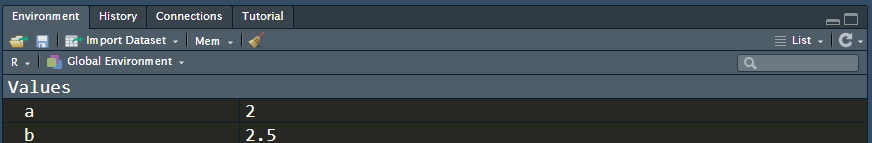
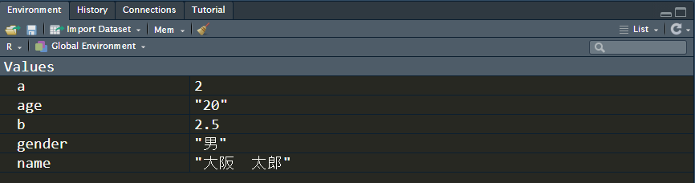
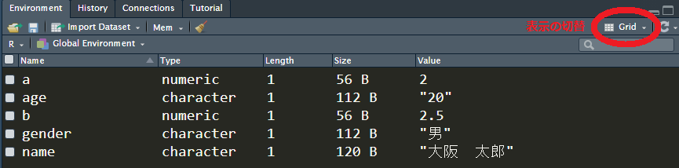
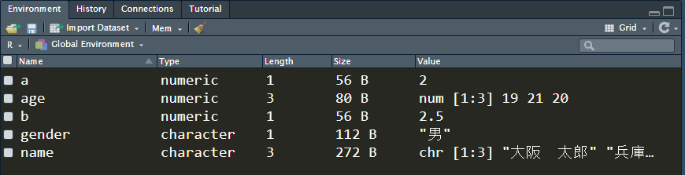
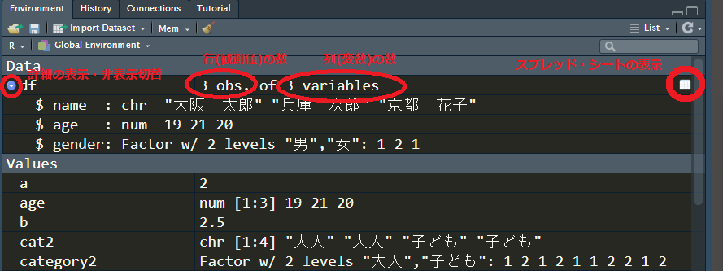
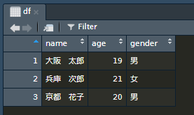
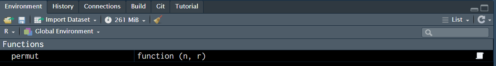

# Rにおけるオブジェクト

## 数値と文字列

Rでは，さまざまな情報を記憶するための「箱」のことをオブジェクトという。オブジェクトには数値や文字，ベクトル，データフレームなどを記憶させることができる。

オブジェクトの名前は比較的自由につけることができる。日本語(漢字)を使うこともできるが，変数名に使うのはなるべく英数字とアンダースコア"\_"だけにした方が良い。

たとえば，a というオブジェクトに2という数値，bというオブジェクトに1.5という数値を記憶させてみよう。

```{r}
a <- 2
b <- 2.5
```

このような操作を「代入」という。代入が正しく行われたかどうかを確認してみよう。

```{r}
a
b
a + b
a * b
```

a, bにそれぞれ2，2.5という数値が代入されていて，a,bを用いた計算もできることがわかる。

また，RStudioの"Environment"タブにオブジェクト名a，bと代入された値が表示されていることもあわせて確認しよう。



オブジェクトには，数値だけではなく，文字列を代入することもできる。文字列は，ダブルクオーテーション""で括る。

```{r}
name <- "大阪　太郎"
gender <- "男"
age <- "20"

```



nameというオブジェクトには"大阪　太郎"という文字列，genderというオブジェクトには"男"という文字列，ageというオブジェクトには"20"という文字列が代入れていることがわかる。

ここで，ageに代入されている"20"は，20という数値ではなく，文字列として扱われていることに注意しよう。そのため，ageを数値として計算に用いることはできず，下のようなエラーとなる。

```{r error=TRUE}

age + 10

```

オブジェクトは代入されるものによっていくつかの型(Type)に分類される。ここでは，a，bは数値型(numeric)，name，gender，ageは文字列型(character)となる。

EnvironmentタブをList表示からGrid表示に切り替えれば，オブジェクトの型が表示される。



文字列型のオブジェクトを数値型に変換したい場合には，as.numeric()関数を用いる。

```{r error=TRUE}
as.numeric(age) + 10
```

この例ではageは文字列型だが，as.numeric(age)でageを数値型に変換している。数値型に変換されているので，計算を行うことができる。

逆に数値型のオブジェクトを文字列型に変換するには，as.character()関数を用いる。

## ベクトル

1つのオブジェクトに，複数の数値や文字列を代入することもできる。複数の数値や文字列が格納されたオブジェクトをベクトルという。たとえば，nameというベクトルに3人の名前を代入し，ageというベクトルに3人の年齢を代入してみよう。ベクトルは，c(要素1,要素2,...)で表す。

```{r error=TRUE}

name <- c("大阪　太郎", "兵庫　次郎", "京都　花子")
age <- c(19, 21, 20)

```

nameとageの内容を確認してみよう。

```{r}
name
age

```

nameとageの内容が先ほどのものと置き換わっていることがわかる。Rでは既存のオブジェクトに改めて別の内容を代入すると，中身が置き換えられる。



Environmentタブで確認すると，nameとageのLengthが1から3へと変わっていることがわかる。Lengthはベクトルの長さ(要素の数)を表す。

ベクトルから1つの要素を取り出すには，ベクトル名のあとに[要素番号]をつける。ただし，ベクトルの要素番号は1から始まることに注意しよう(言語によっては0から始まるものもあるので混乱しないよう)。たとえば，nameというベクトルの2番目の要素を取り出すのであれば，下のように書く。

```{r}
name[2]
```

## ファクター

性別や都道府県，アンケートの「はい」か「いいえ」など，カテゴリを表す情報には，factor型変数を用いる。

たとえば，性別を格納するベクトルgenderを作成し，factor型に変換してみよう。ベクトルをfactor型に変換するにはas.factor()関数を用いる。

```{r}
gender <- c("男", "女", "男")
gender <- as.factor(gender)
```

genderの内容を確認してみよう。

```{r}
gender
```

これは，ベクトルの内容は3人の性別(男，女，男)で，ベクトルの要素は「女」と「男」の2つのレベルに分類されていることを示している。

factor型のオブジェクトは，数値型へと変換することができる。factor型のオブジェクトgenderを数値型に変換して，新しいオブジェクトgender_numに代入してみよう。

```{r}
gender_num <- as.numeric(gender)
gender_num
```

性別が番号(女：1，男：2)に変換されていることがわかる。このとき振られる番号は，Levelsで表示される順番となる。レベルの順番は，factor関数でlevelsを指定することで変更可能。

```{r}
gender <- factor(gender, levels = c("男", "女"))
gender
as.numeric(gender)
```

## データフレーム

複数の(長さが同じ)ベクトルを束ねたオブジェクトをデータフレームという。多くの場合，統計データはデータ・フレームの形に整理して分析する。たとえば，3人の名前が格納されたベクトルname(文字列型)，年齢が格納されたベクトルage(数値型)，性別が格納されたベクトルgender(factor型)を，1つに束ねてdfというデータフレーム・オブジェクトを作成してみよう。データフレームを作成するには，data.frame()関数を用いる。data.frame関数の引数には，データフレームに含めたいオブジェクト(ベクトル)をカンマで区切って指定する。

```{r}
df <- data.frame(name, age, gender)
df
```

行数3(3人分のデータ)，列数3(name, age, genderの3つのベクトル)のデータフレームが作成されたことが確認できる。

Environmentタブにもdfが追加されていることを確認しよう。データフレームの中身を確認したいときには，EnvironmentタブはList表示にしておく方が便利。データフレーム名の左にある青い矢印のようなボタンを押せば，内容の表示・非表示が切り替えられる。



データフレーム名(いまの場合はdf)もしくはその右にあるスプレッド・シートのマークをクリックすれば，ソースコードのペインにデータフレームがExcelのようなスプレッド・シート形式で表示される。



データフレームに含まれる変数(ベクトル)は，データフレーム名\$ベクトル名で表す。たとえば，dfというデータフレームに含まれるageというベクトル(変数)であれば，df\$ageで表す。

たとえば，3人の平均年齢を求めてみよう。

```{r}
mean(df$age)
```

## 関数

Rではほとんどの処理を関数を用いて行う。関数というのは，なにかを入力すれば，それに応じた出力が得られるものである。入力する「なにか」のことを引数という。関数はfunction_name(引数1, 引数2, ･･･)ような形で用いられる。

たとえば，abs()という関数は，引数を1つ入力すれば，その引数の絶対値を返す。

```{r}
abs(-1)
```

関数は，必ずしも何かを計算するためだけに用いるわけではなく，画面に何かを表示させたり，ファイルからデータを読み込んだりといったことも，すべて関数を用いて行う。

また，関数には引数を取らないものもある。たとえば，q()と入力すればRを終了させることができるが，q()も関数である。

## 関数の自作

もとからRに組み込まれている関数に加え，自分で関数を定義することもできる。同じような計算や処理を何度も行うときには，一連の処理を関数として定義しておけば便利だ。

たとえば，順列・組合せを求めたいとしよう。Rには組合せを求める関数としてchoose(n,r)という関数が用意されており，n個のなかからr個を選ぶ組合せが何通りあるかを返す。

たとえば，37個の数字のなかから7個を選ぶ組合せは，以下のように求めることができる。

```{r}
choose(37,7)
```

一方で，Rにはn個の中からr個を取り出す順列を求める関数は用意されていない。そこで，nとrを引数として与えれば，順列を返す関数を自作してみよう。自作の関数は，

```{r}
関数名 <- function(引数1, 引数2, ...){
  ...処理内容...
  }
```

の形で定義する。

n個の中からr個を取り出す順列${}_nP_r$は，

$${}_nP_r = \frac{n!}{(n-r)!}$$

で計算できる。ただし，$n!=n \times (n-1) \times (n-2) \times \cdots \times 1$であり，これを$n$の階乗という。階乗は，factorial()関数で求めることができる。

順列の計算を行う関数をpermut()として定義しよう。

```{r}
permut <- function(n, r){
  p <- factorial(n) / factorial(n - r)
  return(p)
}
```



このコードを実行したら，environmentタブを見てみよう。permutという関数が作成されて表示されているはずだ。

自作の関数permut()の引数はnとrの2つであり，これらを使って${}_nP_r$を計算し，pに代入する。次に，return(p)で順列の計算結果を返す。

return()は関数が返す値を指定するが，これを指定しなければ，関数は最後に行われた計算結果を返す。したがって，permut()関数は以下のように書いても良い。

```{r}
permut <- function(n, r) {factorial(n) / factorial(n - r)}
```

ここでは計算が1つしか行われていないので，その結果が返される。

実際にこの関数を用いて順列を求めてみよう。

```{r}
permut(10, 4)
permut(4, 2)
permut(8, 0)
```
